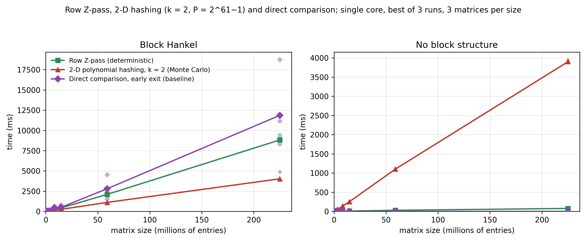
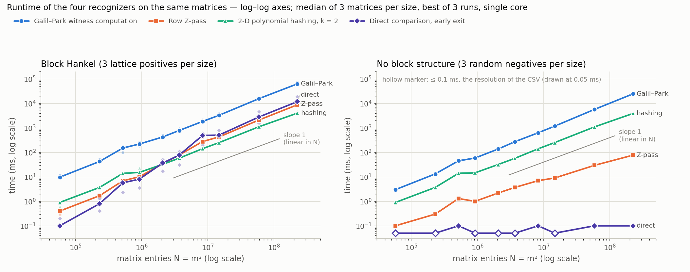
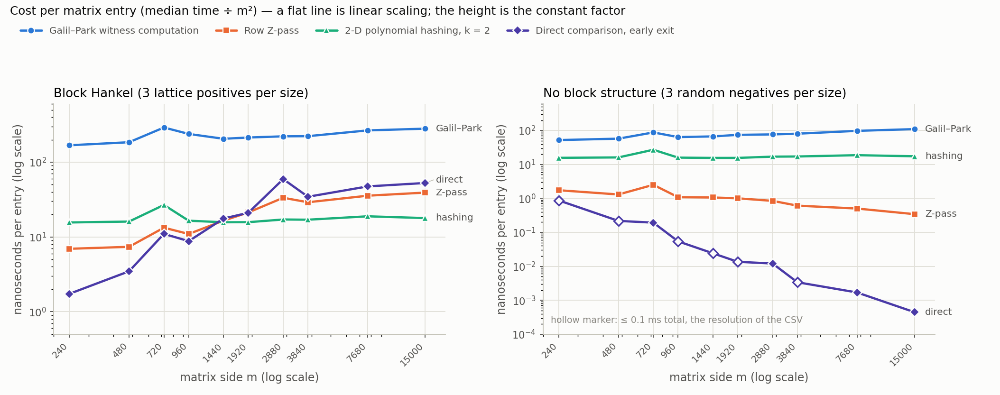
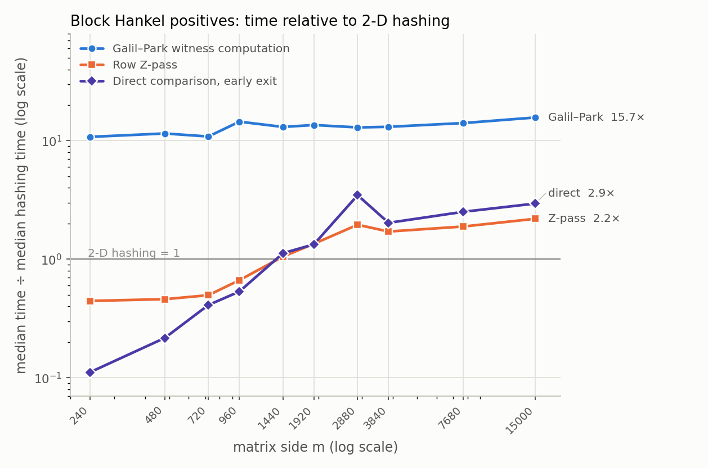

# Benchmark results in detail

Source run: `notebooks/block_Hankel_benchmarking.ipynb`, executed on a Google Colab CPU runtime
(2 vCPUs, 12 GB RAM, g++ 11.4.0, `-std=c++20 -O3 -march=native -DNDEBUG`), command

```
./compare time time_colab.csv 240,480,720,960,1440,1920,2880,3840,7680,15000 3 0
```

Wall time for the whole ladder: 1567 s. Console output: [`run_log_colab.txt`](run_log_colab.txt).
Raw data: [`time_colab.csv`](time_colab.csv) (one row per matrix; times are the best of 3 repetitions in
ms with one decimal, so `0.0` means below 0.05 ms). Derived medians: [`summary_medians.csv`](summary_medians.csv).

Contents

1. [Inputs](#1-inputs)
2. [Correctness cross-checks](#2-correctness-cross-checks)
3. [Medians and per-entry cost](#3-medians-and-per-entry-cost)
4. [Scaling exponents](#4-scaling-exponents)
5. [Ratios](#5-ratios)
6. [Discussion per method](#6-discussion-per-method)
7. [Figures](#7-figures)
8. [Raw table](#8-raw-table-all-60-matrices)

## 1. Inputs

Ten divisor-rich sides `m`; the number of non-trivial admissible pairs tested by every method is
`(d(m) − 1)² − 1`:

| m | 240 | 480 | 720 | 960 | 1440 | 1920 | 2880 | 3840 | 7680 | 15000 |
|---|---:|---:|---:|---:|---:|---:|---:|---:|---:|---:|
| d(m) | 20 | 24 | 30 | 28 | 36 | 32 | 42 | 36 | 40 | 40 |
| pairs tested | 360 | 528 | 840 | 728 | 1224 | 960 | 1680 | 1224 | 1520 | 1520 |

Six matrices per size (`src/tests/compare.cpp`, `time_mode`):

| index | kind | construction |
|---|---|---|
| 0 | positive | lattice generated by `(−2, 5)` and `(−5, 2)`, random symbol per lattice class, alphabet 8 |
| 1 | positive | lattice generated by `(−5, 6)` and `(−6, 5)` |
| 2 | positive | lattice generated by `(−3, 8)` and `(−8, 3)` |
| 3 | negative | uniform random, alphabet 256 |
| 4 | negative | uniform random, alphabet 16 |
| 5 | negative | uniform random, alphabet 2 |

A lattice matrix is `(p, q)` block Hankel for every lattice vector `(−p, q)` with `p, q | m`, so the
positives carry many pairs. The harness reports the *minimal* pairs, i.e. those not implied by a common
divisor `(p/k, q/k)`; all their multiples are also accepted. Number of minimal pairs per positive matrix:

| m | matrix 0 | matrix 1 | matrix 2 |
|---:|---:|---:|---:|
| 240 | 6 | 8 | 2 |
| 480 | 8 | 10 | 4 |
| 720 | 12 | 12 | 4 |
| 960 | 8 | 10 | 4 |
| 1440 | 16 | 16 | 6 |
| 1920 | 10 | 14 | 4 |
| 2880 | 16 | 18 | 6 |
| 3840 | 10 | 14 | 6 |
| 7680 | 12 | 18 | 6 |
| 15000 | 10 | 22 | 16 |

The exact pairs are listed in the raw table at the end.

## 2. Correctness cross-checks

The harness performs these checks on every matrix and repetition:

| check | result |
|---|---|
| Galil–Park answer set = Z-pass answer set = direct-comparison answer set | 60 / 60 matrices agree |
| every pair reported by the deterministic methods is accepted by hashing (no false negative) | 0 false negatives |
| both generator pairs of each positive are found | 30 / 30 |
| no random negative reported as block Hankel | 30 / 30 |
| hashing acceptances not in the deterministic set, accumulated over 3 repetitions with fresh bases | **0 false positives** in 190 512 pair tests (10 584 pairs × 6 matrices × 3 repetitions) |

The Theorem 1 bound on the probability that a fixed false pair is accepted is
`((m − p) + (m − q) − 2)/(P − 1)` per family, at most `3 × 10^4 / 2.3 × 10^18 ≈ 1.3 × 10^{−14}` for
`m = 15000`, and its square for `k = 2`. Zero observed false positives is therefore the expected outcome;
the `fp` mode of the harness exists to exercise the recognizer on many more, smaller, structured inputs.

## 3. Medians and per-entry cost

Median over the three matrices of each kind (each value the best of 3 runs). The per-entry columns are
`median / m²` in nanoseconds; a constant column means linear scaling.

Block-Hankel positives:

| m | Galil–Park ms | Z-pass ms | hashing ms | direct ms | GP ns/entry | Z ns/entry | hash ns/entry | direct ns/entry |
|---:|---:|---:|---:|---:|---:|---:|---:|---:|
| 240 | 9.7 | 0.4 | 0.9 | 0.1 | 168 | 6.9 | 15.6 | 1.7 |
| 480 | 42.6 | 1.7 | 3.7 | 0.8 | 185 | 7.4 | 16.1 | 3.5 |
| 720 | 150.9 | 6.9 | 13.9 | 5.7 | 291 | 13.3 | 26.8 | 11.0 |
| 960 | 220.1 | 10.1 | 15.2 | 8.1 | 239 | 11.0 | 16.5 | 8.8 |
| 1440 | 426.3 | 34.3 | 32.6 | 36.6 | 206 | 16.5 | 15.7 | 17.7 |
| 1920 | 788.4 | 78.4 | 58.1 | 77.6 | 214 | 21.3 | 15.8 | 21.1 |
| 2880 | 1839.5 | 277.3 | 142.0 | 492.7 | 222 | 33.4 | 17.1 | 59.4 |
| 3840 | 3286.6 | 429.3 | 250.8 | 508.4 | 223 | 29.1 | 17.0 | 34.5 |
| 7680 | 15699.4 | 2101.4 | 1113.9 | 2797.0 | 266 | 35.6 | 18.9 | 47.4 |
| 15000 | 63186.6 | 8820.8 | 4022.6 | 11863.1 | 281 | 39.2 | 17.9 | 52.7 |

Random negatives:

| m | Galil–Park ms | Z-pass ms | hashing ms | direct ms | GP ns/entry | Z ns/entry | hash ns/entry | direct ns/entry |
|---:|---:|---:|---:|---:|---:|---:|---:|---:|
| 240 | 3.0 | 0.1 | 0.9 | 0.0 | 52 | 1.74 | 15.6 | < 0.9 |
| 480 | 13.2 | 0.3 | 3.7 | 0.0 | 57 | 1.30 | 16.1 | < 0.2 |
| 720 | 45.3 | 1.3 | 14.0 | 0.1 | 87 | 2.51 | 27.0 | 0.19 |
| 960 | 58.8 | 1.0 | 14.6 | 0.0 | 64 | 1.09 | 15.8 | < 0.05 |
| 1440 | 138.3 | 2.2 | 32.2 | 0.0 | 67 | 1.06 | 15.5 | < 0.02 |
| 1920 | 273.5 | 3.7 | 57.3 | 0.0 | 74 | 1.00 | 15.5 | < 0.01 |
| 2880 | 634.0 | 7.0 | 140.4 | 0.1 | 76 | 0.84 | 16.9 | 0.01 |
| 3840 | 1182.8 | 9.0 | 252.2 | 0.0 | 80 | 0.61 | 17.1 | < 0.01 |
| 7680 | 5731.2 | 29.6 | 1102.7 | 0.1 | 97 | 0.50 | 18.7 | 0.002 |
| 15000 | 24655.3 | 77.1 | 3902.0 | 0.1 | 110 | 0.34 | 17.3 | < 0.001 |

Observations:

- Hashing: 15.5–18.9 ns per entry on every input except `m = 720`; positives and negatives within 3 %.
  The slight rise from 15.6 to 17.9 ns between `m = 240` and `15000` is consistent with the prefix tables
  (two `uint64` tables of `(m+1)²` entries) leaving the caches.
- Z-pass on positives: the cost per entry grows from 7 to 39 ns because every row comparison inside a
  matching stretch runs `memcmp` over the whole row of length `m − q`, and the number of such comparisons
  per divisor is `Θ(m)`; on negatives each `memcmp` stops within the first few bytes and the whole pass
  costs `Θ(m)` per divisor, hence the *falling* per-entry cost.
- Direct comparison on negatives is below the 0.1 ms resolution of the CSV at most sizes: each of the up
  to 1520 candidate pairs is rejected by the first `memcmp`.
- `m = 720` is anomalous for all four methods (per-entry cost 1.6–1.8 × the neighbouring sizes, including
  the direct baseline). A slowdown that hits every method by the same factor points to the shared VM,
  not to the algorithms.

## 4. Scaling exponents

Least-squares slope of `log(median time)` against `log(m²)` over the six largest sizes
(`m ≥ 960`, entries from 0.9 M to 225 M). An exponent of 1 is linear in the number of entries.

| method | positives | negatives |
|---|---:|---:|
| Galil–Park | 1.05 | 1.10 |
| Row Z-pass | 1.22 | 0.78 |
| 2-D hashing, k = 2 | 1.03 | 1.03 |
| Direct comparison | 1.30 | at resolution floor |

## 5. Ratios

Median time divided by the median hashing time at the same size, block-Hankel positives:

| m | Galil–Park / hashing | Z-pass / hashing | direct / hashing | fastest method |
|---:|---:|---:|---:|---|
| 240 | 10.8 | 0.44 | 0.11 | direct |
| 480 | 11.5 | 0.46 | 0.22 | direct |
| 720 | 10.9 | 0.50 | 0.41 | direct |
| 960 | 14.5 | 0.66 | 0.53 | direct |
| 1440 | 13.1 | 1.05 | 1.12 | hashing |
| 1920 | 13.6 | 1.35 | 1.34 | hashing |
| 2880 | 13.0 | 1.95 | 3.47 | hashing |
| 3840 | 13.1 | 1.71 | 2.03 | hashing |
| 7680 | 14.1 | 1.89 | 2.51 | hashing |
| 15000 | 15.7 | 2.19 | 2.95 | hashing |

At `m = 15000` on the random negatives the ratios are Galil–Park 6.3, Z-pass 0.020, direct < 0.00003.

Spread across the three matrices at `m = 15000` (ms):

| matrix | kind | minimal pairs | Galil–Park | Z-pass | hashing | direct |
|---|---|---:|---:|---:|---:|---:|
| 54 | positive | 10 | 61 668.3 | 8 820.8 | 4 022.6 | 11 153.1 |
| 55 | positive | 22 | 72 309.7 | 8 312.9 | 3 982.0 | 18 732.5 |
| 56 | positive | 16 | 63 186.6 | 9 379.1 | 4 949.9 | 11 863.1 |
| 57 | negative, alphabet 256 | – | 24 560.2 | 78.5 | 3 953.2 | 0.1 |
| 58 | negative, alphabet 16 | – | 24 655.3 | 77.1 | 3 901.7 | 0.1 |
| 59 | negative, alphabet 2 | – | 25 162.3 | 77.0 | 3 902.0 | 0.1 |

The direct baseline is the only method whose time tracks the number of accepted pairs (each accepted
pair is a full `m²`-entry scan): matrix 55 with 22 minimal pairs costs it 1.6 × the other two positives,
while hashing and Z-pass are unaffected. The alphabet of the random negatives makes no measurable
difference to any method.

## 6. Discussion per method

**Galil–Park witness computation.** Deterministic, exact and linear in practice (exponent 1.05 / 1.10),
but it answers a much larger question than the block-Hankel one: it settles every candidate vector with
`|v| ≤ m/4` in two quadrants, roughly `m²/8` vectors, whereas only `d(m)²` of them are divisor pairs.
The block-Hankel front end then costs almost nothing (table look-ups plus at most three Z-passes for
divisors above `K`). It is 6 × (negatives) to 16 × (positives) slower than hashing at the largest size
and about twice as slow on positives as on negatives, because duels and LINE calls do more work when
periods actually exist. Its role in this study is the independent oracle: the other three methods are
checked against it on every matrix.

**Row Z-pass.** The simplest exact method: one Z-array per divisor `q`, with rows as symbols and
`memcmp` as equality. On random matrices it is the fastest method that does any preprocessing at all
(77 ms at 225 M entries, 50 × faster than hashing), because a mismatching row pair is detected in its
first bytes. On block-Hankel matrices it is the second-fastest method from `m = 1920` on and finishes
2.2 × behind hashing at `m = 15000`; its exponent of 1.22 on positives reflects that the total number of
row comparisons summed over all divisors grows with `d(m)` as well as with `m`.

**2-D polynomial hashing, k = 2.** Constant 16–19 ns per entry independent of input, matrix size and
alphabet; the fastest method on positives from about 2 M entries. The per-pair test is `O(1)`, so the
1520 candidate pairs at `m = 15000` are invisible in the timing. All of its time is the single pass that
fills two `(m+1)²` prefix tables (`≈ 3.6 GB` at `m = 15000`), which is also its memory cost. Zero false
positives were observed in 190 512 pair tests, in line with a per-pair bound of about `10^{−28}`.

**Direct comparison, early exit.** Fastest below 1 M entries and on every random input, because it does
no preprocessing and a rejected pair costs one `memcmp` of one row segment. It is the only method whose
cost depends on the *answer*: each accepted pair is a full scan, so it is 2.9 × slower than hashing at
`m = 15000` on the median positive and 4.7 × on the positive with 22 minimal pairs. Its `Θ(m² d(m)²)`
worst case (near-block-Hankel input, `near = 1` in the harness) is not part of this run; the notebook
estimates several minutes per matrix at `m = 15000`.

## 7. Figures

Figures A and B are the notebook's own output. Figures C–E are drawn by `scripts/plot_results.py` from
the same CSV.

| file | content |
|---|---|
| [`figures/fig_A_galil_park_linear.png`](figures/fig_A_galil_park_linear.png) | Galil–Park, linear axes, positives and negatives |
| [`figures/fig_B_fast_methods_linear.png`](figures/fig_B_fast_methods_linear.png) | Z-pass, hashing, direct comparison, linear axes |
| [`figures/fig_C_runtime_loglog.png`](figures/fig_C_runtime_loglog.png) | all four methods, log–log axes, with a slope-1 guide |
| [`figures/fig_D_ns_per_entry.png`](figures/fig_D_ns_per_entry.png) | nanoseconds per entry against `m` |
| [`figures/fig_E_ratio_to_hashing.png`](figures/fig_E_ratio_to_hashing.png) | positives, time relative to hashing |







## 8. Raw table (all 60 matrices)

Best-of-3 times in ms. `false_positives` counts hashing acceptances outside the deterministic answer
set over the three repetitions. Minimal pairs are `p×q`.

| # | m | kind | minimal pairs | Galil–Park | Z-pass | hashing k = 2 | direct | false positives |
|---:|---:|---|---|---:|---:|---:|---:|---:|
| 0 | 240 | block Hankel | 2×5, 3×60, 5×2, 15×48, 48×15, 60×3 | 9.7 | 0.4 | 1.0 | 0.1 | 0 |
| 1 | 240 | block Hankel | 1×10, 1×120, 3×8, 5×6, 6×5, 8×3, 10×1, 120×1 | 11.9 | 0.4 | 0.6 | 0.2 | 0 |
| 2 | 240 | block Hankel | 3×8, 8×3 | 9.7 | 0.3 | 0.9 | 0.1 | 0 |
| 3 | 240 | random | – | 2.9 | 0.1 | 0.9 | 0.0 | 0 |
| 4 | 240 | random | – | 3.0 | 0.1 | 0.9 | 0.0 | 0 |
| 5 | 240 | random | – | 3.0 | 0.1 | 0.9 | 0.0 | 0 |
| 6 | 480 | block Hankel | 1×160, 2×5, 3×60, 5×2, 15×48, 48×15, 60×3, 160×1 | 42.4 | 1.7 | 3.7 | 0.8 | 0 |
| 7 | 480 | block Hankel | 1×10, 1×32, 1×120, 3×8, 5×6, 6×5, 8×3, 10×1, 32×1, 120×1 | 51.2 | 1.7 | 3.7 | 1.3 | 0 |
| 8 | 480 | block Hankel | 3×8, 5×160, 8×3, 160×5 | 42.6 | 1.6 | 3.7 | 0.4 | 0 |
| 9 | 480 | random | – | 13.2 | 0.3 | 3.7 | 0.0 | 0 |
| 10 | 480 | random | – | 13.2 | 0.3 | 3.7 | 0.0 | 0 |
| 11 | 480 | random | – | 13.1 | 0.3 | 3.7 | 0.0 | 0 |
| 12 | 720 | block Hankel | 2×5, 3×18, 3×60, 3×144, 5×2, 9×12, 12×9, 15×48, 18×3, 48×15, 60×3, 144×3 | 99.0 | 6.1 | 8.7 | 5.7 | 0 |
| 13 | 720 | block Hankel | 1×10, 1×120, 2×9, 3×8, 5×6, 5×72, 6×5, 8×3, 9×2, 10×1, 72×5, 120×1 | 170.2 | 7.2 | 14.0 | 7.3 | 0 |
| 14 | 720 | block Hankel | 3×8, 8×3, 10×45, 45×10 | 150.9 | 6.9 | 13.9 | 2.3 | 0 |
| 15 | 720 | random | – | 45.3 | 1.3 | 14.1 | 0.1 | 0 |
| 16 | 720 | random | – | 45.1 | 1.3 | 14.0 | 0.1 | 0 |
| 17 | 720 | random | – | 46.1 | 1.3 | 13.8 | 0.1 | 0 |
| 18 | 960 | block Hankel | 1×160, 2×5, 3×60, 5×2, 15×48, 48×15, 60×3, 160×1 | 255.1 | 11.1 | 22.9 | 8.1 | 0 |
| 19 | 960 | block Hankel | 1×10, 1×32, 1×120, 3×8, 5×6, 6×5, 8×3, 10×1, 32×1, 120×1 | 220.1 | 10.1 | 15.2 | 12.0 | 0 |
| 20 | 960 | block Hankel | 3×8, 5×160, 8×3, 160×5 | 183.8 | 9.9 | 14.8 | 3.6 | 0 |
| 21 | 960 | random | – | 57.6 | 1.0 | 14.5 | 0.0 | 0 |
| 22 | 960 | random | – | 58.8 | 1.0 | 14.6 | 0.0 | 0 |
| 23 | 960 | random | – | 59.7 | 1.0 | 14.8 | 0.0 | 0 |
| 24 | 1440 | block Hankel | 1×160, 2×5, 3×18, 3×60, 3×144, 5×2, 9×12, 9×96, 12×9, 15×48, 18×3, 48×15, 60×3, 96×9, 144×3, 160×1 | 416.0 | 34.3 | 32.3 | 36.6 | 0 |
| 25 | 1440 | block Hankel | 1×10, 1×32, 1×120, 2×9, 3×8, 5×6, 5×72, 6×5, 8×3, 9×2, 10×1, 32×1, 32×45, 45×32, 72×5, 120×1 | 509.8 | 33.8 | 32.6 | 50.3 | 0 |
| 26 | 1440 | block Hankel | 3×8, 5×160, 8×3, 10×45, 45×10, 160×5 | 426.3 | 34.6 | 32.6 | 17.1 | 0 |
| 27 | 1440 | random | – | 138.3 | 2.3 | 33.2 | 0.0 | 0 |
| 28 | 1440 | random | – | 138.9 | 2.2 | 32.1 | 0.0 | 0 |
| 29 | 1440 | random | – | 138.0 | 2.2 | 32.2 | 0.0 | 0 |
| 30 | 1920 | block Hankel | 1×160, 2×5, 3×60, 5×2, 5×128, 15×48, 48×15, 60×3, 128×5, 160×1 | 787.7 | 88.3 | 90.3 | 77.6 | 0 |
| 31 | 1920 | block Hankel | 1×10, 1×32, 1×120, 1×384, 3×8, 5×6, 6×5, 8×3, 10×1, 15×128, 32×1, 120×1, 128×15, 384×1 | 943.5 | 78.4 | 58.1 | 108.3 | 0 |
| 32 | 1920 | block Hankel | 3×8, 5×160, 8×3, 160×5 | 788.4 | 71.6 | 57.7 | 31.2 | 0 |
| 33 | 1920 | random | – | 273.7 | 3.7 | 56.9 | 0.0 | 0 |
| 34 | 1920 | random | – | 272.5 | 3.7 | 57.3 | 0.0 | 0 |
| 35 | 1920 | random | – | 273.5 | 3.8 | 57.6 | 0.0 | 0 |
| 36 | 2880 | block Hankel | 1×160, 2×5, 3×18, 3×60, 3×144, 5×2, 9×12, 9×96, 12×9, 15×48, 18×3, 48×15, 60×3, 96×9, 144×3, 160×1 | 1792.6 | 277.3 | 142.0 | 492.7 | 0 |
| 37 | 2880 | block Hankel | 1×10, 1×32, 1×120, 1×1440, 2×9, 3×8, 5×6, 5×72, 6×5, 8×3, 9×2, 10×1, 32×1, 32×45, 45×32, 72×5, 120×1, 1440×1 | 2137.5 | 272.3 | 141.9 | 602.2 | 0 |
| 38 | 2880 | block Hankel | 3×8, 5×160, 8×3, 10×45, 45×10, 160×5 | 1839.5 | 336.6 | 143.6 | 198.5 | 0 |
| 39 | 2880 | random | – | 628.5 | 7.0 | 139.7 | 0.1 | 0 |
| 40 | 2880 | random | – | 643.0 | 7.0 | 140.7 | 0.1 | 0 |
| 41 | 2880 | random | – | 634.0 | 6.9 | 140.4 | 0.1 | 0 |
| 42 | 3840 | block Hankel | 1×160, 2×5, 3×60, 5×2, 5×128, 15×48, 48×15, 60×3, 128×5, 160×1 | 3257.0 | 429.3 | 250.8 | 508.4 | 0 |
| 43 | 3840 | block Hankel | 1×10, 1×32, 1×120, 1×384, 3×8, 5×6, 6×5, 8×3, 10×1, 15×128, 32×1, 120×1, 128×15, 384×1 | 3874.8 | 419.8 | 249.8 | 813.1 | 0 |
| 44 | 3840 | block Hankel | 3×8, 5×160, 5×1920, 8×3, 160×5, 1920×5 | 3286.6 | 510.5 | 252.7 | 266.3 | 0 |
| 45 | 3840 | random | – | 1182.8 | 9.0 | 248.6 | 0.0 | 0 |
| 46 | 3840 | random | – | 1182.6 | 9.1 | 252.2 | 0.0 | 0 |
| 47 | 3840 | random | – | 1183.9 | 9.0 | 253.8 | 0.0 | 0 |
| 48 | 7680 | block Hankel | 1×160, 2×5, 3×60, 3×3840, 5×2, 5×128, 15×48, 48×15, 60×3, 128×5, 160×1, 3840×3 | 15116.9 | 2101.4 | 1165.2 | 2797.0 | 0 |
| 49 | 7680 | block Hankel | 1×10, 1×32, 1×120, 1×384, 3×8, 3×2560, 5×6, 5×512, 6×5, 8×3, 10×1, 15×128, 32×1, 120×1, 128×15, 384×1, 512×5, 2560×3 | 18675.4 | 1974.6 | 1098.5 | 4553.0 | 0 |
| 50 | 7680 | block Hankel | 3×8, 5×160, 5×1920, 8×3, 160×5, 1920×5 | 15699.4 | 2359.9 | 1113.9 | 1527.8 | 0 |
| 51 | 7680 | random | – | 5605.4 | 30.4 | 1095.6 | 0.1 | 0 |
| 52 | 7680 | random | – | 5737.9 | 29.1 | 1102.7 | 0.1 | 0 |
| 53 | 7680 | random | – | 5731.2 | 29.6 | 1112.9 | 0.1 | 0 |
| 54 | 15000 | block Hankel | 1×1000, 2×5, 3×60, 3×375, 5×2, 8×125, 60×3, 125×8, 375×3, 1000×1 | 61668.3 | 8820.8 | 4022.6 | 11153.1 | 0 |
| 55 | 15000 | block Hankel | 1×10, 1×120, 1×1000, 1×3750, 2×75, 2×625, 3×8, 3×250, 5×6, 6×5, 8×3, 8×25, 10×1, 24×625, 25×8, 75×2, 120×1, 250×3, 625×2, 625×24, 1000×1, 3750×1 | 72309.7 | 8312.9 | 3982.0 | 18732.5 | 0 |
| 56 | 15000 | block Hankel | 3×8, 5×50, 5×600, 5×5000, 8×3, 10×375, 15×1250, 25×30, 30×25, 40×125, 50×5, 125×40, 375×10, 600×5, 1250×15, 5000×5 | 63186.6 | 9379.1 | 4949.9 | 11863.1 | 0 |
| 57 | 15000 | random | – | 24560.2 | 78.5 | 3953.2 | 0.1 | 0 |
| 58 | 15000 | random | – | 24655.3 | 77.1 | 3901.7 | 0.1 | 0 |
| 59 | 15000 | random | – | 25162.3 | 77.0 | 3902.0 | 0.1 | 0 |

